[< Index](index.md)

# Interact with your Chocolate

Here we will see some nice features implemented into the Chocolate.

> As a remainder, you could code your own agent, with your own features.

For the demonstration, I started an **HTTP Listener** on port **5555** (well, in practice, you should consider, 80 or 443). I built the Chocolate with a **sleep time** of **2 seconds** and a **jitter time** of **10 seconds**. Thats mean's that every **2s** more or less **rand(0, 10)**, the agent will ask for a task to Mjollnir.

You can see the Chocolates and the Listeners on the **Dashboard** tab:

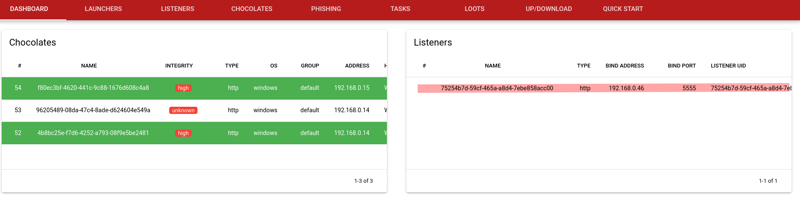

On that figure you could see the **Listener** that is up, and all my Chocolates.

Let's click on the **Chocolate 54**, which has an **High Integrity Level** (in green):

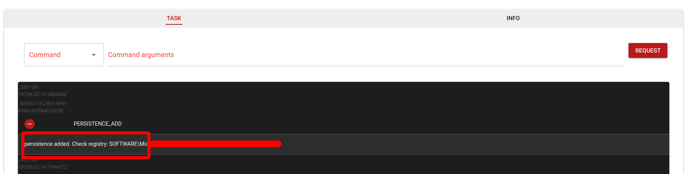

As we can see, there is already a task that has been performed !! This is because I tell Mjollnir to execute the task **PERSISTANCE_ADD** as soon a new Chocolate registers.

Doing so, all my new Chocolates will add persistence to the victime machine they are running on.

You can check the basic info that the Chocolate returns by clicking on the **INFO** tab:

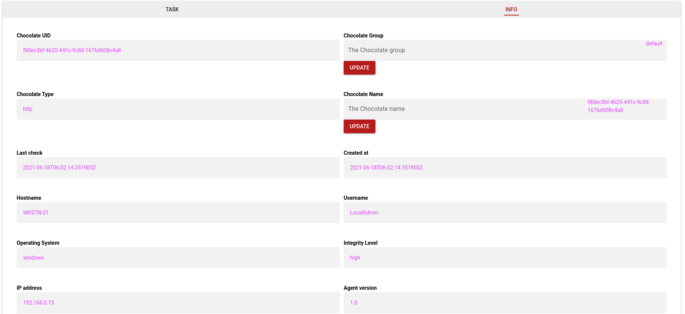

You see that your Chocolate is on the **default** group, it is running on a machine with the hostname **WKSTN-01**. It has been launched with the user **LocalAdmin** with a **High Integrity Level**. The IP is **192.168.0.15**, and the Chocolate is in version **1.0**.

Let's start easy and check the network interfaces for instance. On your windows host, you could use:
```
ipconfig /all
```

Well, you could do the same here. On the Command's menu, select **CMD**, and on the **Command arguments** write down **ipconfig /all**. Sooner, you will get the result of the supplied command:

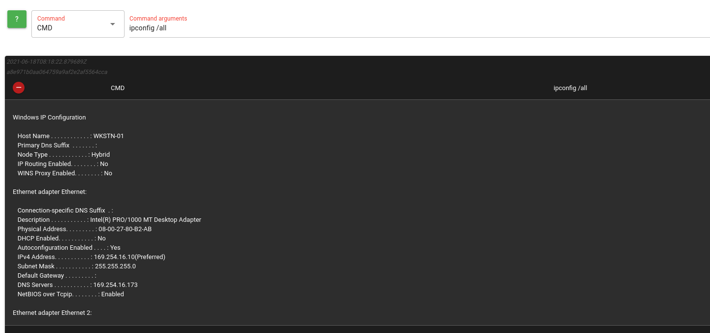

Maybe you would like to execute powershell command? Let's try to grab all running processes

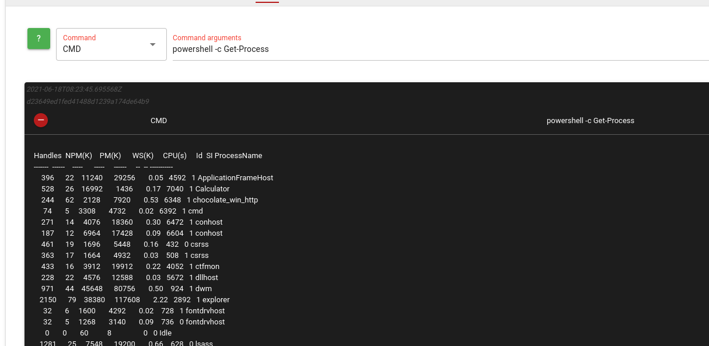

Ok, so we can interact with the remote machine as if we have a remote shell. This is a very basic feature. You may want something more powerfull. Let's see which commands do we have in stock. Mmmh, oh, there is a **SCAN** command. How does it works? Let's click on the **?** button next to it:

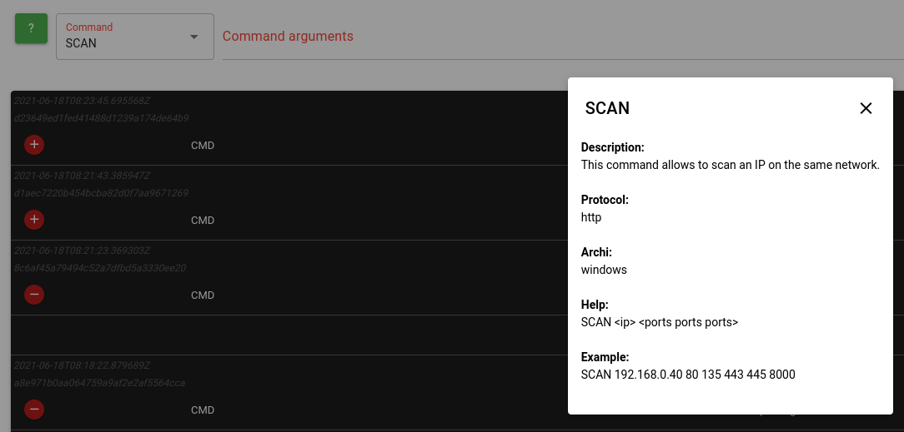

The **Help** popup tells me that I have to specify the **ip** to be scanned, and the **ports** to be scanned as well. Everything space separated. Let's try that. As I am on my lab machine, I will try to scan it for the ports that I am sure are opened:
* 3030: Mjollnir api
* 8080: Mjollnir frontend
* 5555: Listener
* 1234: not opened !

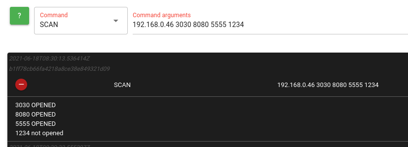

It seems to work well. But, I have to tell you, that this scanner is clearly not powerfull. It has to be used to confirm that a port is well opened, like 139, 445, 80 and so on. If you want to perform a full scan of a victim machine, I recommand you to use a more suitable scanner, like **nmap**.

We have an other usefull command, which is **DUMP_PID**. Well, it seems clear. This command allows the Chocolate to dump a process. Let's see the help:
* DUMP_PID \<pid\> \<location\>

The **pid** is the pid of the process you want to dump. The location is the location where you want the dump. As my chocolate is running under a High Privilege Level, I will try to dump **lsass** process. This is quite common on internal intrusion assessment. As I already get all the processes running on the machine earlier, I know that **lsass process** has the pid **628**:

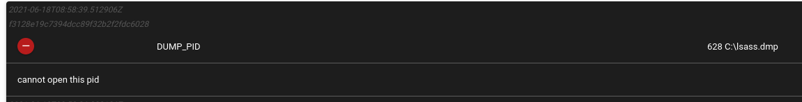

Hum, I cannot dump lsass process. We should be **SYSTEM** in order to dump such a process. Let's create a **scheduled task** as **SYSTEM** in order to launch a new Chocolate !
```
CMD SCHTASKS /CREATE /SC ONCE /RU "SYSTEM" /TN "MyTasks\Legit task" /TR "C:\Users\localadmin\Desktop\chocolate_win_http.exe" /ST 02:20
```

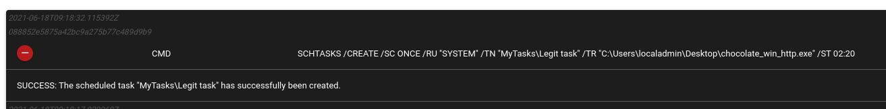

We soon get a new Chocolate as **SYSTEM**. Let's try to dump **lsass** by now:

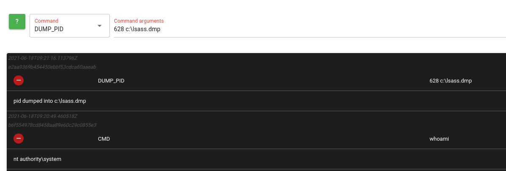

**BINGO !**

You may think, what if I don't have enough features availables on my Chocolate? Well, you could start a **meterpreter** for exemple to get more stuff to do. There are three ways to inject a shellcode:
* **ASM**: will execute a shellcode into the virtual address space of the Chocolate process. Could be tricky, because if your shellcode is flagged as malicious and ended, you Chocolate will be killed too.
* **INJECT_SC**: will inject your shellcode into the virtual address space of an other process and execute it
* **INJECT_DLL**: will inject your DLL into an other process and execute its main()

Here, I choose to inject a shellcode with the **INJECT_SC** command. First I have to generate the **meterpreter** and start a handler:

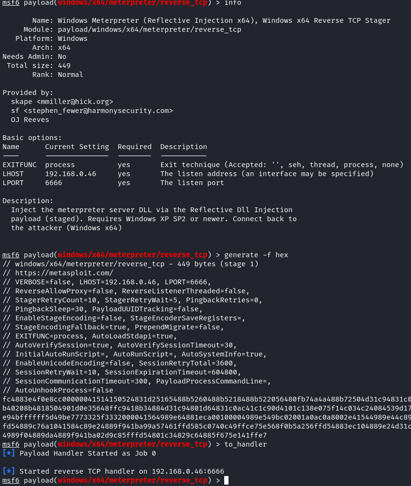

You will see that I created a meterpreter payload and displayed it as hex. The handler is listening on the port 6666. By now, if I execute this shellcode using the **ASM** command and if it get caugth by the antivirus, the meterpreter will be killed for sure, but my Chocolate too. So the trick is to execute this shellcode into an other process (evil !!!).

Let's look at the **INJECT_SC** command's help:
* INJECT_SC \<bytecode\>

Fairly easy ! Just copy-paste the bytecode, and the shellcode will be execute inside the nodepad.exe process !!

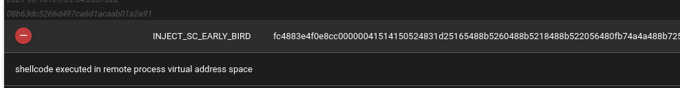

And you get your meterpreter back:

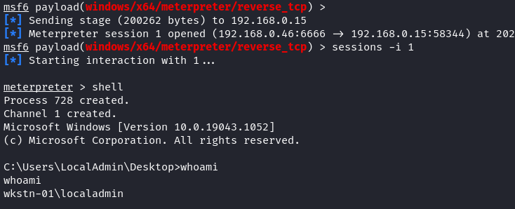

Hum, my injection seems good, as the antivirus doesn't flag the malicious code injection. However, be carefull if you deal with **EDR** (Endpoint Detection and Response) as it may hooks some windows APIs, and thus detects your code injection.

You could already imagine the magic. Imagine you use the **bulk tasks** that allows you to spread a command on all your agents !! You will get a bunch of meterpreters poping all around !

There are more commands to be used. You have to explore them by yourself !