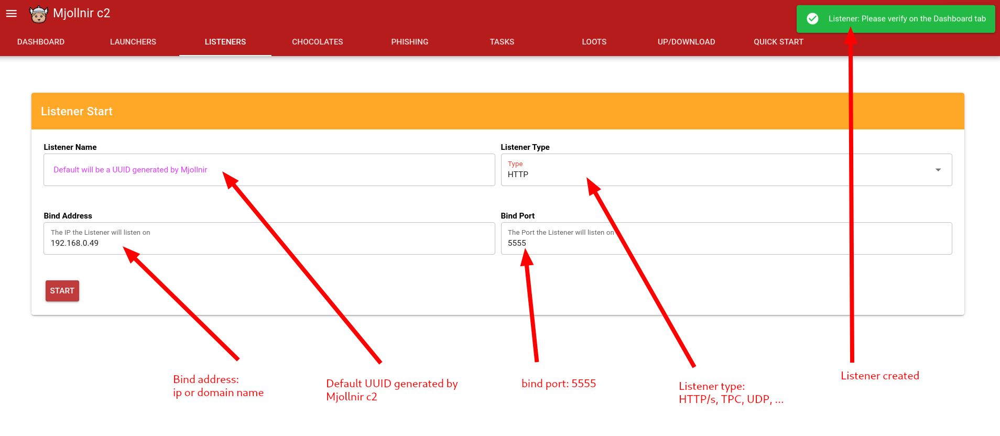
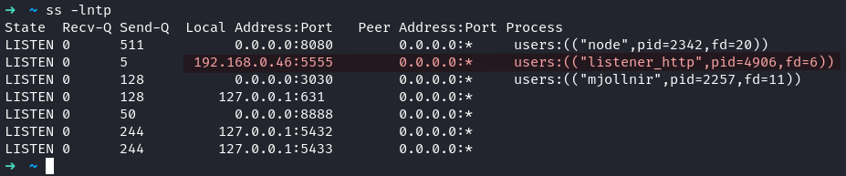
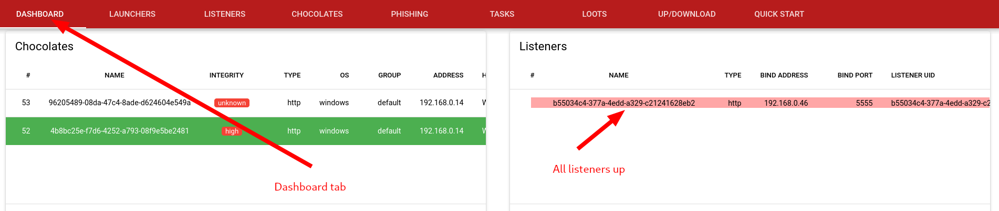
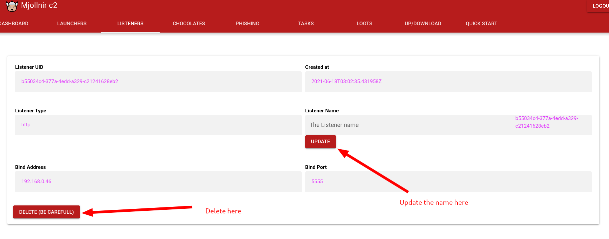
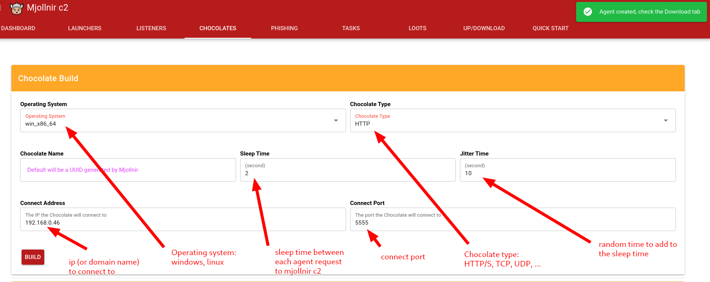
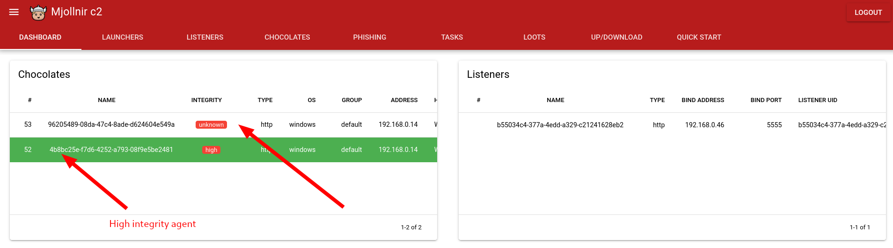
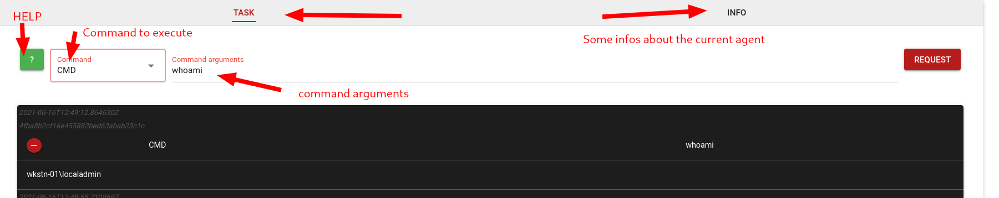
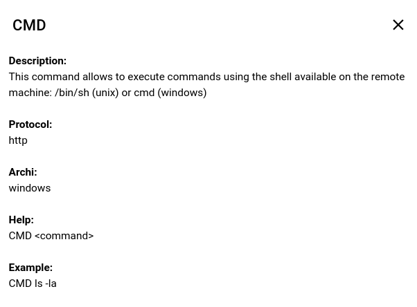

# Launch your first chocolate

< [index](install-mjollnir-c2.md)

\> 

The agent's name used into _Mjollnir_ is named a **Chocolate**. This is the equivalent of the **Meterpreter** into _Metasploit_, the **Grunt** into _Covenant_, or the **Beacon** into __Cobalt Strike__, and so on.

Before using a **Chocolate**  you need to start a listener that will handle the connection of all of your **Chocolates**.

All requests need to be authenticated. When you login, you will grab 2 cookies containing:
* user\_uid
* user\_token

And thus you have to provide those cookies when performing a request to an endpoint of the mjollnir API.

## Create a listener

You need to be authenticated in order to be able to create a listener, that's why there are a **user_uid** and a **user_token** in the following request:
```
$ curl -X POST 'http://127.0.0.1:3030/listener' -H 'Content-Type: application/json' -d '{"listener_type": "tcp", "listener_bind_port": "8080", "listener_bind_address": "127.0.0.1"}' -b 'user_uid=XXXXXXXX ; user_token=XXXXXXXX' -v
```

But you can use the webui as well. Click on the **Listeners** tab, than fill the form:



The user can see that in order to create a listener he needs to specify the **listener_type** which is **tcp**, **http/s**, **udp** and so on, but the **listener_bind_port** and the **listener_bind_address** as well.

When a listener is created, Mjollnir will start the corresponding listener. And so, Mjollnir populates the database with the informations of the freshly started listener. The user can manually see the content of the database with:
```
$ psql -h 127.0.0.1 -d mjollnir -U postgres
mjollnir=# select * from listener;
```

Of course, the user can manually check if the binded port is well opened:
```
$ ss -lntp
```




## List all listeners

There is a endpoint that list all the listeners that are saved into the mjollnir database. You can request it like:
```
$ curl -X GET 'http://127.0.0.1:3030/listener/' -b 'user_uid=XXXXXXXX ; user_token=XXXXXXXX' 
$ curl -X GET 'http://127.0.0.1:3030/listener/?search_port=8080' -b 'user_uid=XXXXXXXX ; user_token=XXXXXXXX' 
```

This endpoint is also reachable from the webui, on the **Dashboard** tab:



Once, on that tab, you can click on a listener to view its properties, and perform some action on it: delete/update

## Delete a listener

You could delete a listener from the database. Besides, doing that action will also shut down the listener if it is still up. The following request show how to contact the corresponding endpoint:
```
curl -X DELETE 'http://127.0.0.1:3030/listener/XXXXXXXX' -b 'user_uid=XXXXXXXX ; user_token=XXXXXXXX' -v
```

This endpoint is also reachable from the webui



By deleting a listener, the corresponding entry into the Mjollnir database will be deleted too. The user can verify manually into the **listener table** that the listener is not present anymore, and using the **ss -lntp** command to check out that the binded port is not listening anymore.

## Update a listener name
```
curl -X PUT 'http://127.0.0.1:3030/listener' -H 'Content-Type: application/json' -d '{"listener_uid": "XXXXXXXX", "listener_name": "new name"}' -b 'user_uid=XXXXXXXX ; user_token=XXXXXXXX' -v
```

By default the name of the listener is the listener uid, but sometimes you would like to specify directly an other listener name.

Once you launched your listener, you can build your **Chocolate** like following.

## Create a chocolate

Each agent is build when you need it, and will have a hash different from the previous one. This allows that a basic detection rule based only on the hash will not work here.

```
$ curl -X POST 'http://127.0.0.1:3030/agent' -H 'Content-Type: application/json' -d '{"agent_os":"win_x86_64", "agent_type":"tcp", "agent_ip": "127.0.0.1", "agent_port":"8080", "agent_sleep":"2", "agent_jitter":"10"}' -b 'user_uid=XXXXXXXX ; user_token=XXXXXXXX' -v
```



* **agent_type**: has to match the listener's type that you launch previously
* **agent_ip**, **agent_port**: have to match your listener's parameters
* **agent_sleep**: the agent waits for making an other request to the listener.
* **agent_jitter**: in order to not send periodic request to the c2, a random time is added -> **agent_sleep + rand(0, agent_jitter)**

An agent does nothing by itself, it always asks for a task to the listener.

You can code your own agent and integrate it within Mjollnir c2 very easily. We will see later the requirements/guideline in order to code your very own agent the right way. Let's continue.

## List all agents

Here are the endpoints used to list all agents connected to mjollnir c2:
```
$ curl -X GET 'http://127.0.0.1:3030/agent/' -b 'user_uid=XXXXXXXX ; user_token=XXXXXXXX' 
$ curl -X GET 'http://127.0.0.1:3030/agent/?search_uid=XXXXXXXX' -b 'user_uid=XXXXXXXX ; user_token=XXXXXXXX'
```

The **search_uid** parameter allow to look for an **agent_uid** in particular.

Use the dashboard tab to see all your agents:



When an agent is started in high integrity level, you could see that it is in green, else it has no colour.

You can interact with a Chocolate by clicking on the corresponding raw.



There is a **command menu** that allow you to execute multiple actions with your agent. Here is an exemple of some implemented commands:


There is a **green help button** next to the **command menu**. When clicked, it displays a popup with the command's help:



We will see later some advanced features about the interaction with an agent.

## Update a agent name/group

You can change the name of your chocolate. Initially it has a random UUID, but it is not very easy to remember. Besides, your agent is automatically added to the **default** group. You may want to change that as well.

In order to perform those action, you have to click on the **INFO** tab

```
curl -X PUT 'http://127.0.0.1:3030/agent' -H 'Content-Type: application/json' -d '{"agent_uid": "XXXXXXXX", "agent_name": "new name", "agent_group": "default"}' -b 'user_uid=XXXXXXXX ; user_token=XXXXXXXX' -v
```


> You can delete on agent on that page too. Be carreful, it is only deleted from the Mjollnir database. It is not removed from the victim machine !

## List all agent groups

```
$ curl -X GET 'http://127.0.0.1:3030/group' -b 'user_uid=XXXXXXXX; user_token=XXXXXXXX' -v
```

You could add your agent to a group. This could be usefull when you want to execute a command on several agents but not all at the same time.

To list all of your agent on the webui, there is the **Dashboard** tab.